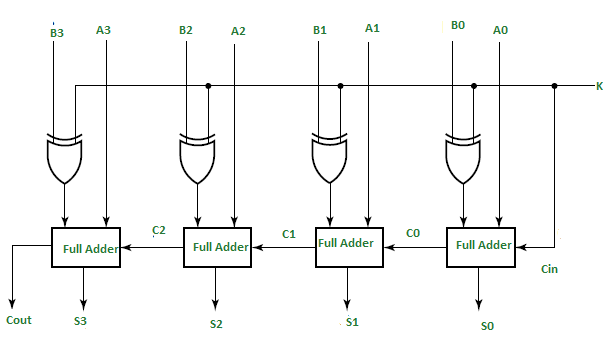
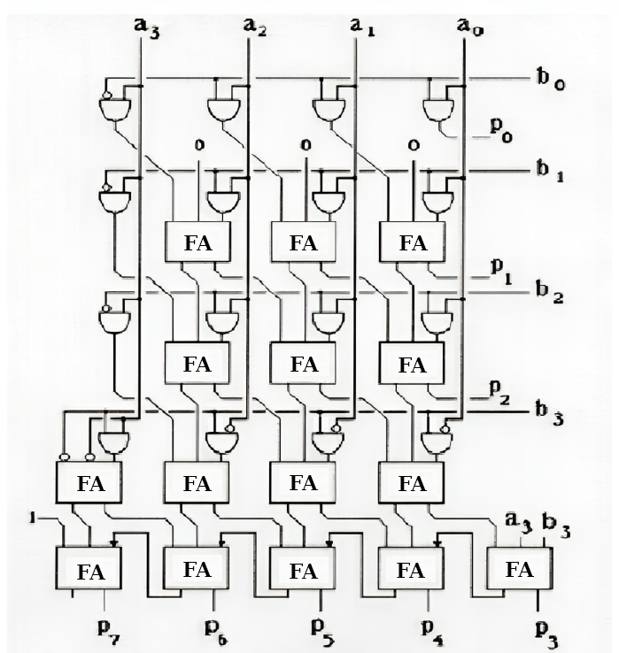

Here I made implementation of integer coefficients matrix inversion

**Note:** invertible matrix should have det = 1 or det = -1

## How it works
* converting integers to bit-vectors in two's complement format
* addition is implemented with FullAdder primitives
* multiplication is implemented with Baugh-Wooley circuit
* Boolean circuits are converted to CNF with [Tseytin transformation](https://en.wikipedia.org/wiki/Tseytin_transformation)
* CNFs are solved by Z3 solver
* **Note:** no control of integer overflow, but it could be implemented easily

## Details

### Addition circuit
for 4-bit signed integers



### Multiplication circuit
for 4-bit signed integers

*I have found typo in original paper, so here is fixed circuit*



## Usage

**Note:** `z3` should be available in your `PATH`

Call program with following arguments provided:

```
 --solver               z3 | cadical | cryptominisat5 | kissat
 -bw,--bitwidth <arg>   bit width of bit vectors (8 for example)
 -c,--cnf <arg>         Path to file for output CNF in DIMACS format
 -m,--matrix <arg>      Path to text file with matrix
```

Example
```
--solver cadical --bitwidth 8 --matrix matrix/4x4.txt --cnf out.cnf
```

Gives following output
```
== input ==
2 1 0 1
3 2 0 -2
0 1 1 0
-1 2 3 4

== cnf summary ==
gates count = 28817
variables count = 28705
clauses count = 94145

== solver time ==
168 millis

== output ==
6 -5 12 -4
-10 9 -21 7
10 -9 22 -7
-1 1 -3 1
```

#### Bonus: SAT solver comparison
command:
```
--bitwidth 16 --matrix matrix/10x10.txt --cnf out.cnf --solver [paste solver here]
```

```
== matrix ==

16 bit
10x10 matrix

== cnf summary ==
gates count = 1677101
variables count = 1675601
cnf clauses count = 5555601

== results ==
kissat           6559  millis
z3               10869 millis
cadical          18543 millis
cryptominisat5   24404 millis
```